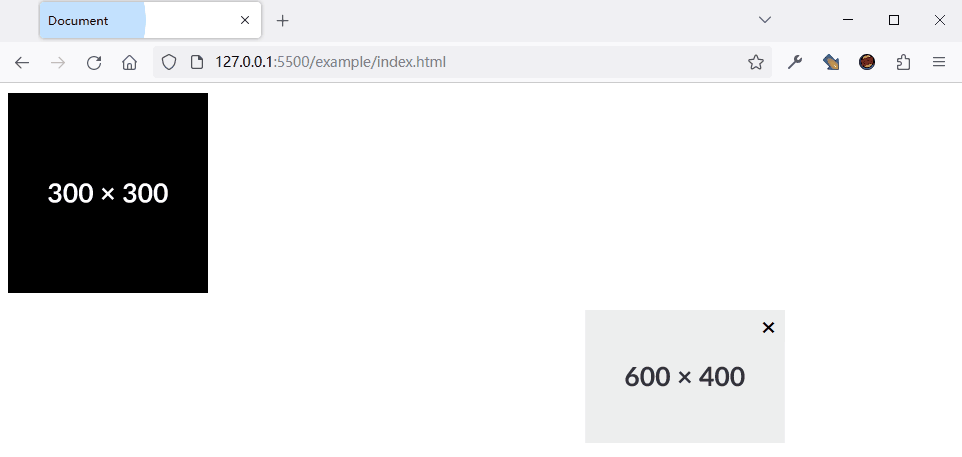

# Floaty.js


Floaty is a library that aims to create floating element in website.

## Screenshot



## Features

-   Create multiple floating elements in one page.
-   Multiple config options.

## Installation

To install Floaty, follow these steps:

```html
<script type="text/javascript" src="./floaty.js"></script>
```

## Usage

To use Floaty, follow these steps:

```javascript
Floaty();
```

## Configure

```javascript
Floaty({
    speed: 100, // Move speed
    statuX: 1, // Range of motion X
    statuY: 1, // Range of motion Y
    randomStatus: false, // Random range of motion
    x: 10, // Initial position X
    y: 10, // Initial position Y
    randomPosition: false, // Random initial position
    closeButton: false, // Close button
    img: "https://placehold.co/300x300/000/fff", // Image URL
});
```

## License

Floaty is released under the MIT License
